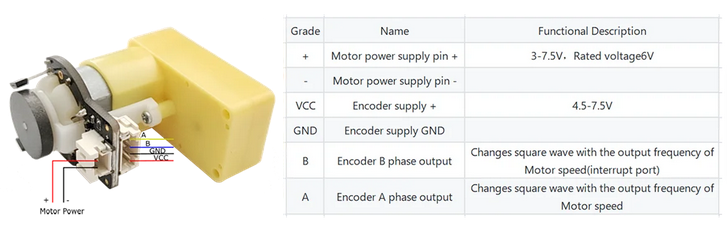
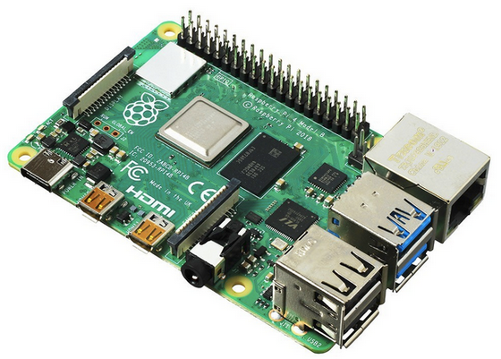
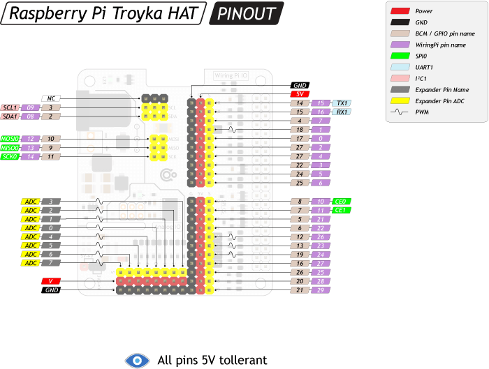
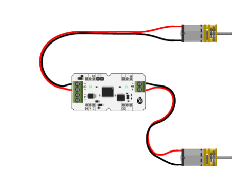
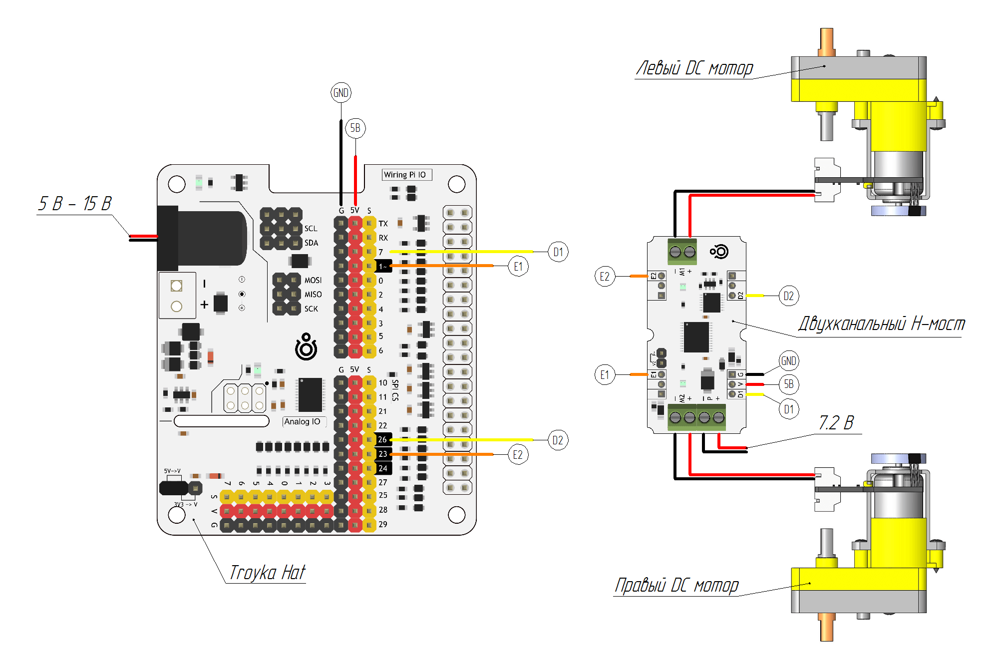
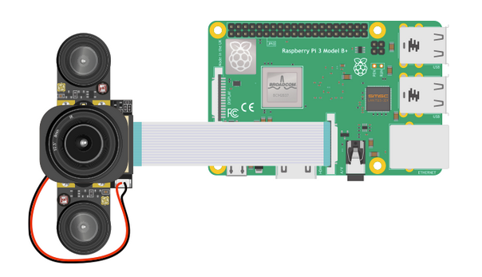
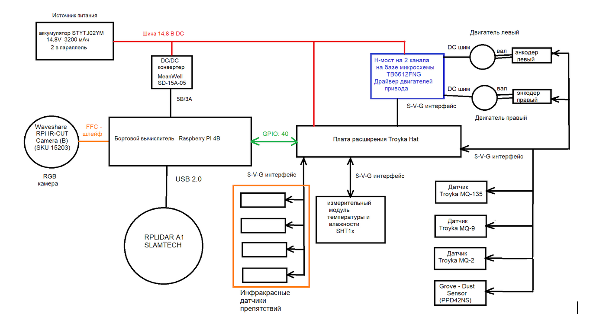

## Отчет по финальной работе по курсу Linux для робототехников

### Этап 1. Выбор концепции мобильного робота

#### 1.1 Назначение робота 
Проектируемый робот относится к мобильным роботам. Его задача - исследование помещений и сбор данных об окружающей среде (температура, влажность, состав воздуха). Робот предназначен для работы в помещениях со сложной планировкой, выполняет построение карты помещения, строит карты распределения температуры, давления, влажности, зоны повышенной концентрации вредных газов, в частности аммиака, бензиновых паров, природного газа, дыма и пыли. 

#### 1.2 Общая компоновка мобильного робота
Разрабатываемый робот является автономным. Он состоит из следующих систем:
Механическая система, включающая в себя силовой каркас, элементы для  крепления узлов робота, механизм перемещения (редукторы и колесно-моторные блоки), бамперы, кожухи, крышки и т.п.
Электрическая система, включающая в себя силовую часть, обеспечивающую перемещение робота в пространстве (электропривод робота), источник электрической энергии (аккумуляторы Li-Ion) и устройства для стабилизации напряжения на борту робота (DC/DC конвертеры и т.д.), информационную часть (сенсоры и датчики) в частности энкодеры для получения одометрии, датчики температуры, влажности, газоанализаторы, лидар, датчики препятствий, Wifi и Bluetooth модули и т.д., а также систему управления на базе одноплатного компьютера, обеспечивающую функционирование робота.
Компоненты схемы и обоснование их выбора будут подробно рассмотрены далее.

#### 1.3 Выбор и обоснование концепции механической системы
Согласно рекомендациям [1, 2] при выборе концепции привода необходимо руководствоваться назначением робота, эффективностью колесной одометрии, а также принимать во внимание технологичность, доступность узлов и компонентов системы. Также необходимо обеспечить успешную ориентацию в помещении и возможность маневрировать в стесненных условиях. По этой причине был выбран двухколёсный дифференциальный привод с пассивными колёсами. Выбранный привод  состоит из двух ведущих колёс, которые установлены на противоположных сторонах корпуса, и одного всенаправленного (пассивного) колёса (шаровой опоры). Каждое ведущее колесо приводится в движение собственным мотором и управляется независимо друг от друга. Шаровая опора устанавливается для достижения равновесия всей платформы. С точки зрения технологичности  изготовления выбрана готовая платформа типа Turtle от DFRobot [3] . Общий вид платформы представлен на рисунке 1.


Рисунок 1. Общий вид платформы мобильного робота [1].

Для получения одометрии разрабатываемого мобильного робота применяются датчики вращения, установленные на колесах. Приводы штатного шасси не имеют энкодеров, поэтому по рекомендациям, изложенным в [1] были применены мотор-редукторные блоки с квадратурными магнитными энкодерами типа TT Geared Motor with Encoder (6V 160RPM 120:1 L Shape). Эти энкодеры имеют разрешение 16 импульсов на 1 оборот и установлены на вал двигателя, что позволяет более точно отслеживать угол поворота, а следовательно повысить точность одометрии. При передаточном отношении редуктора 120:1 полное разрешение составляет 1920 импульсов на оборот колеса с минимальным измеряемым шагом в 0°11’15", что является достаточным для функционирования робота.  Данные мотор-редуктора представлены на рисунке 2.



Рисунок 2. Мотор-редуктор с установленным энкодером.
Описание подключения энкодеров будет рассмотрено в разделе 1.6. 

#### 1.4 Выбор бортового компьютера и операционной системы
Согласно требованиям технического задания в качестве операционной системы выбрана операционная система для роботов ROS2 (Robot Operation System). Для установки ROS2 Iron будет установлена операционная система Ubuntu 22.04.
Для обеспечения функционирования выбранной ОС и ROS2 согласно рекомендациям [1] выбран бортовой компьютер Raspberry Pi 4B (см. рисунок 3).



Рисунок 3 Общий вид одноплатного компьютера Raspberry pi 4B [6]
Характеристики компьютера представлены в таблице 1.

Таблица 1. Характеристики бортового компьютера Raspberry Pi 4B
| Параметр | Значение|
|----------|---------|
| Центральный процессор | 64-битный четырёхъядерный ARM Cortex-A72 1,5 ГГц на однокристальном чипе Broadcom BCM2711 |
| ОЗУ | 4ГБ LPDDR4-3200 SDRAM|
| Графический процессор | VideoCore VI GPU с тактовой частотой 500 МГц |
| Интерфейсы и разъемы | HDMI, RJ-45 Ethernet, USB 2.0, microUSB |
| Модули связи | Bluetooth 5.0 BLE   Wi-fi 802.11 b/g/n |
| Число портов | micro-HDMI - 2, USB 2.0 – 2, USB 3.0 - 2 |
| Порты ввода-вывода | GPIO: 40 |
| Порты камеры | MIPI CSI (15 пинов, шаг 1 мм), MDPI DSI (15 пинов, шаг 1 мм) |
| Параметры питания | Напряжение питания 5В, Максимальный потребляемый ток 3А|


Для управления двигателями и подключения периферийных устройств будет использована  плата расширения Troyka Hat [1, 7]. Общий вид платы представлен на рисунке 4.



Рисунок 4 Плата расширения Troyka Hat. Распиновка [1, 7]

Платформа Troyka HAT имеет на борту I²C-расширитель портов на микроконтроллере STM32F030F4P6 с вычислительным ядром ARM Cortex M0. Контроллер даёт восемь дополнительных пинов ввода-вывода с аппаратной поддержкой 12-битного АЦП и 16-битного ШИМ [7]. Для подключения большинства устройств будет использован интерфейс S-V-G (S — (signal)  информационный  цифровой или аналоговый вывод; V — (voltage) подключение питания с рабочим напряжением; G (ground) — подключение к выводу “земля”.

#### 1.5 Силовая часть и управление перемещением робота
Для бортового питания проектируемого робота согласно рекомендациям [1, 2] будут использованы два аккумулятора STYTJ02YM 14,8V 3200 мАч, соединенные параллельно. Это даст напряжение на батарее 14,8 В при емкости 6400 мАч. Для получения стабильных 5 В для питания бортового компьютера Troyka HAT будет использован DC/DC конвертеры,например MeanWell SD-15A-05 (SD-15A-5), DC/DC преобразователь, 15Вт, вход 9.2-18В, выход 5В/ 3А.
Для управления двигателями будем использовать драйвер на базе L298N либо H-мост на 2 канала (Troyka-модуль) на базе микросхемы TB6612FNG, допускающей работу при предельном напряжении 15 В [8]. Схема подключения двигателей показана на рисунке 5.



Рисунок 5. Подключение двигателей механизма перемещения робота [9] к силовой части Н-моста. Кабель подключения к аккумулятору не показан.

Применение ШИМ напряжения позволяет регулировать частоту вращения двигателей в широком диапазоне и обеспечивать точное управление движением робота. Управление осуществляется по интерфейсу S-V-G

#### 1.6 Информационная система робота
В соответствии с техническим заданием робот выполняет замеры параметров воздуха, а именно температуры, влажности, концентрацию вредных газов. При этом желательно обеспечить единый интерфейс для подключения датчиков. В настоящей работе для подключения датчиков загазованности применен интерфейс GPIO (Интерфейсы Raspberry Pi), а подключение выполнено с помощью трехпроводных шлейфов S-V-G. Для определения уровня загазованности используются датчики, представленные в таблице 2:

Таблица 2. Типы датчиков для анализа состава газа в помещении
| Тип загрязнителя | Датчик |
|------------------|--------|
| Аммиак, спирт, бензин, СО2 | Troyka-MQ135 |
| Угарный газ, метан, сжиженные углеводородные газы | Troyka-MQ9 |
| Пропан, бутан, метан, водород, дым | Troyka MQ2 |
| Пыль, дым | Grove - Dust Sensor (PPD42NS) |

Для определения температуры и влажности воздуха используем модуль измерительный модуль температуры и влажности SHT1x [10] со следующими характеристиками:
- Диапазон температур: −40…+128 °С
- Погрешность температуры: ±0,3 °С (при 25° C)
- Диапазон влажности: 0–100%
- Погрешность влажности: ±2% (при влажности 10−90%)
- Время реакции: не более 4 с
- Номинальный потребляемый ток: 6 мкА
Датчик подключается через трехпроводный шлейф S-V-G

Для получения одометрии используются энкодеры, описание которых приведено в параграфе 1.3. Подключение энкодеров выполняется с помощью интерфейса  S-V-G как показано на рисунке 6 [1].



Рисунок 6. Подключение энкодеров с помощью интерфейса S-V-G.

Для определения препятствий используется четыре инфракрасных датчика, которые позволяют определить наличие препятствий перед собой. При отсутствии препятствия датчик выдаёт логическую единицу, а при появлении препятствия — логический ноль. Датчики подключаются к управляющей электронике с помощью интерфейса S-V-G. 

Для построения карты согласно рекомендациям [1 -2] применен лидар  полем зрения в 360°. В настоящем проекте применен лидар RPLIDAR A1 от SLAMTECH. Этот лидар обеспечивает 360-градусное поле сканирования с частотой обновления от 2 Гц до 10 Гц. Дальность действия RPLIDAR A1 составляет около 8 метров. Лидар поставляется в виде готового устройства и подключается к бортовому компьютеру через  USB-порт. Для этого лидара разработан официальный пакет rplidar в ROS, который поддерживается производителем датчика — SLAMTECH. Напряжение питания датчика 5В.

Для визуализации изображения применяется камера Waveshare RPi IR-CUT Camera (B) (SKU 15203) со следующими характеристиками [11]:
- Датчик изображения: OV5647
- Разрешение: 5 Мп
- Захват фото: 2592×1944 пикселей
- Запись видео: 1080p30, 720p60 и 640x480p60/90
- Фокус: регулируемый вручную
- Угол обзора: 40°
- Фокусное расстояние: 8 мм
- Диафрагма: F1,2
- Длина шлейфа: 160 мм
- Габариты: 31×32 мм

Камера подключается к компьютеру через FFC-шлейф в разъём CSI (Camera Serial Interface) как показано на рисунке 7.



Рисунок 7 Подключение камеры к вычислительному устройству через FFC-шлейф [11].

#### 1.7 Структурная схема робота
Рассмотрим схему подключения компонентов робота:

Схема подключения к Raspberry PI 
- Подключение  через Troyka Hat S-V-G интерфейс
  - Инфракрасные датчики препятствий
  - Измерительный модуль температуры и влажности SHTx
  - Энкодеры
  - Датчики Troyka  MQ-2, MQ-9, MQ135
  - Датчик Grove - Dust Sensor (PPD42NS)
  - Двухканальный H-мост для управления двигателями
- Подключение через порт USB
  - RPLIDAR A1 
- Подключение через шлейф  FFC-шлейф в разъём CSI
  - камера Waveshare RPi IR-CUT Camera (B) (SKU 15203)

Программная архитектура
- Операционная система: Ubuntu 22.04
- Для управления: ROS2 Iron
- Для обработки изображения: OpenCV 
- Для навигации: SLAM-алгоритмы

Структурная схема проектируемого робота представлена на рисунке 8.



Рисунок 8. Структурная схема робота

### Этап 2. Установка ROS2 на Raspberry Pi и настройка рабочей среды
#### 2.1 Установка системы ROS
Для установки ROS2 Iron был написан скрипт, представленный ниже:
``` bash
#!bin/bash

#Проверим права суперпользователя
if [ "$(id -u)" != "0" ]; then
    echo "Необходимо запустить скрипт от имени root или c sudo"
    exit 1
fi

#Выполним установку и настройку системной локали
echo "Настройка системной локали..."
sudo apt-get update && sudo apt install -y locales
sudo locale-gen en_US.UTF-8
sudo update-locale LC_ALL=en_US.UTF-8 LANG=en_US.UTF-8
export LANG=en_US.UTF-8
echo "Завершена установка и настройка системной локали"

#Добавление репозитория ROS2
echo "Добавление репозитория ROS2..."
sudo apt update && sudo apt install -y curl gnupg lsb-release
sudo curl -sSL https://raw.githubusercontent.com/ros/rosdistro/master/ros.key -o /usr/share/keyrings/ros-archive-keyring.gpg
echo "deb [arch=$(dpkg --print-architecture) signed-by=/usr/share/keyrings/ros-archive-keyring.gpg] http://packages.ros.org/ros2/ubuntu $(source /etc/os-release && echo $UBUNTU_CODENAME) main" | sudo tee /etc/apt/sources.list.d/ros2.list > /dev/null

#Установка ROS2
echo "Установка ROS2 Desktop версии..."
sudo apt update
sudo apt install -y ros-iron-desktop

#Настройка окружения
echo "Настройка окружения ROS2..."
echo "source /opt/ros/iron/setup.bash" >> ~/.bashrc
source ~/.bashrc

echo "Установка дополнительных инструментов..."
sudo apt install -y\
    python3-rosdep \
    python3-vstool \
    python3-colcon-common-extensions
    python3-flake-8 \
    python3-pytest-cov \
    python3-pip

#Установка пакета setuptools
pip3 install setuptools==58.2.0

echo "Инициализация rosdep"
sudo rosdep init
rosdep update

#Обновление существующего терминала
source ~/.bashrc
echo "Установка ROS2 завершена успешно!"
```
Для запуска установки следует вызвать команду
```bash
sudo ./<путь до папки scripts>/scripts/rosinstall.sh
``` 

Для проверки работоспособности ROS2 необходимо ввести команду в терминале 
```bash
ros2 version
```

#### 2.2 Создание рабочего пространства ROS2
Для создания рабочего пространства выполним следующие действия:
1. Создадим структуру каталогов c помощью команды
```bash
mkdir -p ~/ros2_ws/src
```
Выполним переход в папку src 
```bash
cd ~/ros2_ws
```
2. Выполним сборку рабочего пространства с помощью команды:
```bash
colcon build
```
3. Активируем рабочее пространство с помощью команды:
```bash
source install/setup.bash
```

### Этап3. Подготовка и сборка пакетов ROS для функционирования робота

#### 3.1 Установка пакета ROS для RPLIDAR A1
Для установки пакета ROS для RLIDAR  A1 необходимо выполнить следующие действия 
Склонировать репозиторий с помощью команды
```bash
git clone https://github.com/Slamtec/rplidar_ros.git
```
Для получения ноды `rplidarNode` и `rplidarNodeClient` необходимо запустить команду 
```bash 
catkin_make
```  
Для запуска ноды rplidarNnode  отображения в rviz необходимо запустить команду 
```bash
roslaunch rplidar_ros view_rplidar_a1.launch
```
Результат сканирования должен отобразиться в rviz. Для запуска rviz необходимо в вести rviz в новом окне терминала.. Для тестового запуска следует  в окне терминала ввести команду
```bash
roslaunch rplidar_ros rplidar_a1.launch 
```
Результат сканирования должен быть выведен в терминал. 

#### 3.2 Установка библиотеки WiringPi
Для использования GPIO-контактов Raspberry Pi установим библиотеку для C++ WiringPi. Для сборки библиотеки выполним клонирование с репозитория с помощью команды в терминале на Raspberry Pi:
```bash
git clone https://github.com/WiringPi/WiringPi.git
```
После этого перейдем в папку WiringPi с помощью команды 
```bash
cd WiringPi
```
и выполним сборку с помощью команды 
```bash 
./build
```
Убедимся, что библиотека собралась и установилась правильно с помощью команды :
```bash
gpio -v
```
#### 3.3 Работа с датчиком температуры и влажности
Для работы с датчиком температуры и влажности в ROS Noetic используем пакет rosserial_mbed.
Для установки выполним следующие действия:
1. перейдем в папку src
```bash 
cd ~/catkin_ws/src
```
2. Выполним клонирование  репозитория 
```bash 
git clone https://github.com/ros-drivers/rosserial.git
```

3.  Выполним сборку библиотеки
```bash
cd ~/catkin_ws
catkin_make
source devel/setup.bash
```
4. Выполним генерацию ros_lib
```bash
rosrun rosserial_mbed make_libraries.py ~/ros/lib
```
5. Выполним установку переменных окружения
```bash
export GCC4MBED_DIR=~/gcc4mbed
export ROS_LIB_DIR=~/ros/lib/ros_lib
```

####  3.4 Создание ROS пакета для USB камеры в ROS Noetic

1. Выполним установку пакета usb_cam через терминал:
```bash
sudo apt-get install ros-noetic-usb-cam
```
2. Создадим launch файл `usb_cam.launch` в директории launch вашего пакета:
```bash
touch usb_cam.launch
    Создайте новый launch файл (например, usb_cam.launch) в директории launch вашего пакета:

xml

<launch>
    <node name="usb_cam" pkg="usb_cam" type="usb_cam_node" output="screen">
        <param name="video_device" value="/dev/video0"/>
        <param name="image_width" value="640"/>
        <param name="image_height" value="480"/>
        <param name="pixel_format" value="yuyv"/>
        <param name="camera_frame_id" value="usb_cam"/>
    </node>
</launch>

Шаг 3: Запуск камеры

    Запустите узел камеры:

bash

roslaunch your_package_name usb_cam_test.launch

Работа с несколькими камерами

Если необходимо использовать несколько камер, создайте launch файл следующего вида:
xml

<launch>
    <node name="usb_cam1" pkg="usb_cam" type="usb_cam_node" output="screen">
        <param name="video_device" value="/dev/video0"/>
        <param name="image_width" value="640"/>
        <param name="image_height" value="480"/>
        <param name="pixel_format" value="yuyv"/>
        <param name="camera_frame_id" value="usb_cam1"/>
    </node>
    
    <node name="usb_cam2" pkg="usb_cam" type="usb_cam_node" output="screen">
        <param name="video_device" value="/dev/video1"/>
        <param name="image_width" value="640"/>
        <param name="image_height" value="480"/>
        <param name="pixel_format" value="yuyv"/>
        <param name="camera_frame_id" value="usb_cam2"/>
    </node>
</launch>

Проверка работы камеры

    Запустите rqt_image_view для проверки потока:

bash

rqt_image_view

    Выберите тему /usb_cam/image_raw для просмотра изображения.

Основные параметры конфигурации

    video_device: путь к устройству камеры (обычно /dev/video0)

    image_width: ширина изображения в пикселях

    image_height: высота изображения в пикселях

    pixel_format: формат пикселей (yuyv, mjpeg и др.)

    camera_frame_id: идентификатор кадра камеры

Возможные проблемы

    Если камера не определяется, проверьте:

        Правильно ли указан video_device

        Подключена ли камера

        Есть ли у пользователя права на доступ к устройству

    Если возникают проблемы с форматом изображения, попробуйте изменить параметр pixel_format.


#### Литература
1. Данилин М. Как сделать робота на ROS своими руками. Часть 1: шасси и бортовая электроника: [Эл. ресурс] Дата обращения 26.08.2025 / https://amperka.ru/blogs/projects/abot-robot-part-1?srsltid=AfmBOoofVpeHL-sbQbYWR8ywId5tOgTdadrXjlcHYcXppn5Wxe-1lJbt
2. Бромбах Л. Практическая робототехника. С++ и  Rasperry Pi: Пер. с англ.- СПб.: БХВ-Петербург, 2023.-448 с.
Тurtle: 2WD Arduino Mobile Robot Platform wiki- DFRobot: [Эл. ресурс] Дата обращения 26.08.2025 / https://wiki.dfrobot.com/2WD_Mobile_Platform_for_ Arduino__SKU_ROB0005_
3. Двигатель DFRobot 6В с энкодером: [Эл. ресурс] Дата обращения 26.08.2025 https://aliexpress.ru/item/32665572840.html?sku_id=12000037586074046&spm=a2g2w.productlist.search_results.5.4cc57936tR7Jnu
4. ROS Noetic Ninjemys [Эл. ресурс] Дата обращения 26.08.2025 / https://wiki.ros.org/noetic
5. Микрокомпьютер Raspberry Pi 4 Model B (4 ГБ памяти) [Эл. ресурс] Дата обращения 26.08.2025 / https://amperka.ru/product/raspberry-pi-4-model-b-4-gb?utm_source=man&utm_campaign=raspberry-pi-troyka-hat&utm_medium=wiki
6. Troyka HAT: подключение, настройка и начало работы [Эл. ресурс] Дата обращения 26.08.2025 / https://wiki.amperka.ru/products:raspberry-pi-troyka-hat
7. Datasheet на драйвер моторов TB6612FNG [Эл. ресурс] Дата обращения 26.08.2025 / https://wiki.amperka.ru/_media/products:troyka-h-bridge-dual:tb6612fng-datasheet.pdf
8. H-мост на 2 канала (Troyka-модуль): инструкция, схемы и примеры использования [Эл. ресурс] Дата обращения 26.08.2025 / https://wiki.amperka.ru/products:troyka-h-bridge-dual#%D0%BF%D0%BE%D0%B4%D0%BA%D0%BB%D1%8E%D1%87%D0%B5%D0%BD%D0%B8%D0%B5_%D0%BA%D0%BE%D0%BB%D0%BB%D0%B5%D0%BA%D1%82%D0%BE%D1%80%D0%BD%D1%8B%D1%85_%D0%BC%D0%BE%D1%82%D0%BE%D1%80%D0%BE%D0%B2
9. Датчик температуры и влажности SHT1x [Эл. ресурс] Дата обращения 26.08.2025 / https://amperka.ru/product/temperature-humidity-sensor-sht1x
10. Камера (IR-CUT B) для Raspberry Pi: инструкция, примеры использования и документация [Эл. ресурс] Дата обращения 26.08.2025 / https://amperka.ru/product/camera-raspberry-pi-model-ir-cut-b
11. Ubuntu install of ROS Noetic [Эл. ресурс] Дата обращения 07.09.25 // https://wiki.ros.org/noetic/Installation/Ubuntu

